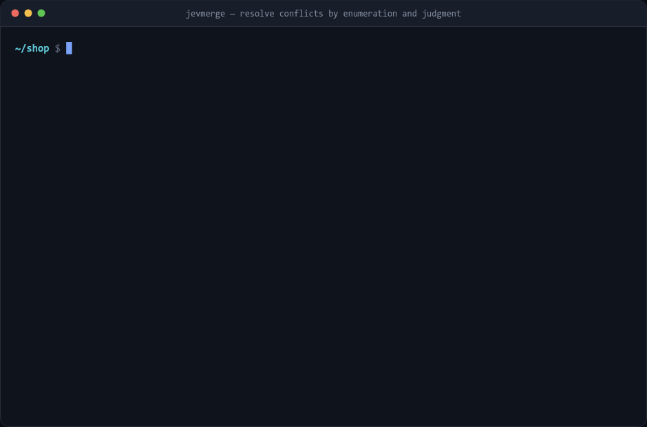
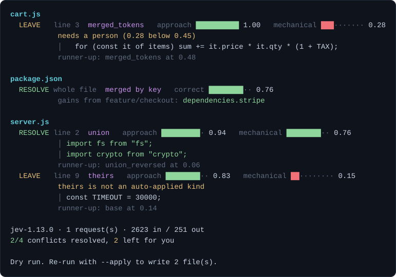

# jevmerge

Resolves git merge conflicts by generating the possible resolutions and having a model
pick one.

For each conflict it computes the candidate resolutions (ours, theirs, union, line merge,
token merge), discards the ones that do not parse, and sends the rest to a model to
choose between. The model selects a candidate. It does not write code, so it cannot
produce a file that fails to parse. It can pick the wrong candidate, which you catch by
reading the diff.



The clip runs it against four conflicts. It resolves three and leaves the fourth.
`demo/capture.sh` builds the repo and runs the commands, `demo/render.mjs` draws the
captured output.

**Contents:** [Quick start](#quick-start) · [Output](#output) · [How it works](#how-it-works) ·
[JSON](#json-files) · [Options](#options) · [Benchmark](#benchmark) ·
[Thresholds](#thresholds) · [Limits](#limits) · [Layout](#layout)

## Quick start

Requires Node 20+, git, and a [TypeSafe](https://typesafe.ai) API key. No runtime
dependencies; the tool imports only Node built-ins.

```bash
git clone https://github.com/hfnissum-byte/jevmerge.git
cd jevmerge
cp .env.example .env        # add your key
node test/run.mjs           # 46 offline tests, no API calls
```

In a repository with conflicts:

```bash
node /path/to/jevmerge/jevmerge.mjs            # report only
node /path/to/jevmerge/jevmerge.mjs --apply    # write the resolutions that pass the gates
```

Without `--apply` nothing is modified. Nothing is staged or committed in either case.
Unresolved conflicts keep their markers.

## Output



| field | meaning |
| --- | --- |
| `RESOLVE` / `LEAVE` | whether the conflict will be written or left for you |
| `merged_tokens`, `union`, … | which kind of resolution was chosen |
| `approach` | probability the model assigns to that kind, 0 to 1 |
| `mechanical` | probability that this is a merge rather than a decision for a person |
| `correct` | JSON only: whether the key merge is right and safe to apply unreviewed |
| `│ …` | the lines that would be written |
| `runner-up` | next best candidate, shown when above 0.05 |

Both bars must clear their thresholds before a conflict is written. Bars are amber near
the threshold and red below it.

Resolution kinds:

| kind | result |
| --- | --- |
| `ours` | current branch's version |
| `theirs` | incoming branch's version |
| `union` | both, one after the other |
| `merged_lines` | both, combined across lines |
| `merged_tokens` | both, combined within a line |
| `structural` | JSON merged key by key |
| `base` / `drop` | revert both, or delete the region |

Two conflicts in the sample were left:

- `server.js` line 9: the branches set the same timeout to 1s and 30s. `mechanical 0.15`
  reflects that there is no mechanical answer.
- `cart.js` line 3: the token merge scored 1.00 on approach but 0.28 on mechanical.
  Multiplying a tax rate by a quantity changes the result of the function, so it is not
  a merge.

## How it works

### 1. Rebuild the conflict with its base

The working-tree file contains both sides but not the common ancestor. jevmerge reads
git's index stages (`:1:` base, `:2:` ours, `:3:` theirs) and runs
`git merge-file --diff3` on them, which gives each hunk its base. The working tree is not
modified.

### 2. Generate candidates

Per hunk: `ours`, `theirs`, `base`, `union` in both orders, `drop`, plus a line-level and
a token-level three-way merge. The same merge function runs at both scales.

The token pass handles the case where both sides edited one line compatibly:

```
base      sum += it.price;
ours      sum += it.price * it.qty;
theirs    sum += it.price * (1 + TAX);
candidate sum += it.price * it.qty * (1 + TAX);
```

The candidate appears in neither branch.

### 3. Discard candidates that do not parse

Each candidate is rendered into the full file and parsed, with the other conflicts in
that file pinned to `ours`. Checking a hunk in isolation is not sufficient; it can parse
on its own and still break the surrounding code.

### 4. Ask the model

All conflicts in the repository go out in one request. Jev is a System One model: it
returns typed values with probabilities instead of generating text. Two question types
are used.

- `Choice` over the surviving candidates: which one preserves both sides' intent.
- `Noul`, a yes/no with a probability: whether a person needs to decide this.

The second question is separate because confidence does not cover it. A conflict can have
one clearly best mechanical resolution and still require a decision, for example two
valid timeout values or a check that one branch removed.

### 5. Gate

Thresholds are applied in code. The chosen kind must also be on the list allowed to apply
unattended. Conflicts that fail a gate keep their markers.

## JSON files

A line or token merge cannot resolve two branches adding different keys to
`package.json`, because the result requires a comma that appears in neither version.

`.json` files are therefore parsed from all three stages, merged key by key, and
serialised once. One Noul asks whether the result is correct and safe to apply.

The structural merge declines and falls back to the line path when it cannot settle the
conflict: two values for one key, an ambiguous array order, or a key deleted on one side
and edited on the other. It also declines when the result equals one side, since that is
a choice between branches and the Choice question handles it.

## Options

| Flag | |
| --- | --- |
| `--apply` | write files; without it nothing is modified |
| `--confidence <0-1>` | minimum `approach` (default 0.75) |
| `--safe <0-1>` | minimum `mechanical` (default 0.45) |
| `--kinds <a,b,…\|all>` | kinds allowed to apply unattended (default set from the benchmark) |
| `--context <n>` | lines of context sent to the model (default 6) |
| `--all` | apply everything, ignoring the gates |
| `--json` | machine-readable output |
| `--model <name>` | override the model |

Exit codes: `0` all resolved, `1` some left, `2` nothing to do or an error.

## Benchmark

`bench/replay.mjs` replays merges from a real repository. For each merge commit it checks
out the first parent, merges the second, runs jevmerge, and compares the result to the
merge commit's tree.

```bash
node bench/replay.mjs --repo /path/to/a/clone --max 25
```

Scoring is per conflict region, anchored on the stable lines on either side. Whole-file
comparison does not work here because merge commits also contain edits unrelated to the
conflicts.

Over 25 conflicted merges from `expressjs/express`, 118 conflict regions had a recoverable
answer. In 77% of them the committed resolution was among the candidates. The remaining
23% were not reachable by any combination of the two sides.

With all kinds enabled:

| kind chosen | correct |
| --- | --- |
| `ours` | 5/5 (100%) |
| `merged_lines` | 19/23 (83%) |
| `union` | 2/3 (67%) |
| `theirs` | 0/17 (0%) |
| `union_reversed` | 0/4 (0%) |
| `base` | 0/1 |
| total | 26/53 (49%) |

`theirs` was chosen 17 times and was wrong every time. Excluding it and `union_reversed`
raises precision from 49% to 81% with no loss of recall, since neither produced a correct
result. That is the default; `--kinds all` restores them.

The committed resolutions were `ours` 55% of the time, `merged_lines` 27%, `theirs` 10%.
Express merges a maintenance branch into a development branch and the development side
usually wins, so these proportions are specific to that workflow.

Coverage is low even with the gates. On a 10-merge confirmation run, 5 of 7
auto-resolutions were correct and 82% of the solvable conflicts were left for a human. The
model's selection is the limiting factor, not the candidate generation: in 17 regions the
committed answer was `ours` and it was not chosen. `--apply` is useful as a first pass
over the mechanical conflicts. Review the diff afterwards.

## Thresholds

Six runs over the same two-file merge:

| signal | range |
| --- | --- |
| structural `correct` | 0.76 – 0.78 |
| two added imports, `approach` | 0.94 – 0.96 |
| two added imports, `mechanical` | 0.59 – 0.67 |
| 1s vs 30s timeout, `mechanical` | 0.15 – 0.17 |

The Choice is stable across runs and the Noul is not, so the Noul threshold is the one
that matters. The Noul still separates the two cases, roughly 0.16 against 0.63, so the
signal is usable and the original threshold was badly placed. `--safe` was 0.60, inside
the upper range, and the same conflict resolved or did not depending on the run. It now
defaults to 0.45, with about 0.14 of margin on either side.

That is fitted to two clusters. Run the benchmark on your own merges with `--json` and
adjust both thresholds.

### Gating on approach rather than confidence

Two orderings of a union are the same resolution in a different order. The Choice
distributes probability across both, which lowers confidence even though the model is not
uncertain about the kind.

The first conflict this was tested on selected the correct resolution at 0.64 with its own
reverse ordering at 0.30. Summed, the kind had 0.94.

The gate therefore sums probability across candidates of the same kind, which is what the
`approach` column shows. The selection within the kind is still the model's. `ours` and
`theirs` have one candidate each, so their numbers are unchanged.

## Limits

- Content conflicts only. Add/add, delete/modify and rename conflicts are reported and
  skipped.
- Syntax checking covers `.js`, `.mjs`, `.cjs`, `.py` and `.json`. Other file types are
  checked for leftover conflict markers and otherwise accepted. Add cases to
  `lib/validate.mjs` for more.
- `node --check` is unreliable for `.js`. A `.js` file containing ESM syntax exits 0 even
  when it does not parse: the CommonJS parse fails, Node retries as a module, and the
  error is discarded. The validator checks JavaScript as `.mjs`, then `.cjs`. There is a
  regression test for this.
- A resolution that parses and preserves both sides can still be wrong. Review the diff.

## Layout

| Path | |
| --- | --- |
| `jevmerge.mjs` | CLI: generate, judge, gate, write, report |
| `lib/git.mjs` | index stages, diff3 reconstruction, branch context |
| `lib/conflicts.mjs` | conflict marker parsing and rendering |
| `lib/candidates.mjs` | three-way merge over lines and tokens |
| `lib/structured.mjs` | three-way merge over JSON keys |
| `lib/validate.mjs` | per-extension syntax checks |
| `lib/judge.mjs` | builds and sends the request |
| `test/run.mjs` | 46 offline tests, no git or API |
| `bench/replay.mjs` | replays merges and scores against the commit |
| `bench/inspect.mjs` | dumps one conflict with its candidates and the committed answer |
| `demo/capture.sh` | builds the demo repo and records the runs |
| `demo/render.mjs` | renders a recording as a GIF |
| `demo/svg.mjs` | renders one run as the SVG above |

```bash
npm test
```

## Credentials

`TYPESAFE_API_KEY` in a `.env` file next to `jevmerge.mjs`, or in the environment. `.env`
is gitignored; see `.env.example`.
