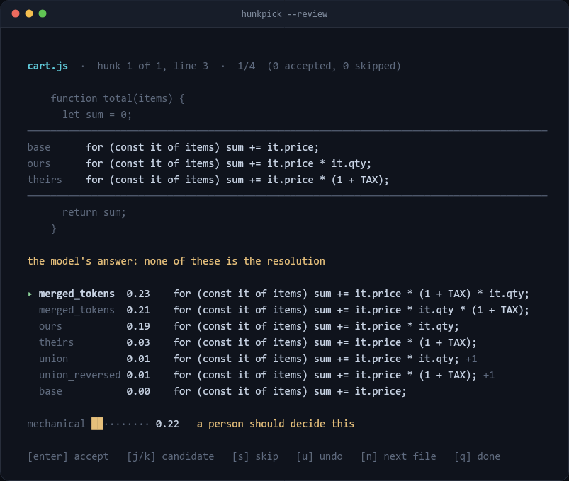

# Hunkpick

[](https://github.com/hfnissum-byte/Hunkpick/actions/workflows/test.yml)

Resolves git merge conflicts by working out every possible resolution and having a model
pick one.

It computes the candidates itself — ours, theirs, union, a line merge, a token merge —
throws away the ones that do not parse, and asks the model only to choose. The model never
writes code, so it cannot produce a file that fails to parse. It can pick the wrong
candidate, which is what review mode is for.



## Quick start

Node 20+, git, and a [TypeSafe](https://typesafe.ai) API key. No runtime dependencies.

```bash
git clone https://github.com/hfnissum-byte/Hunkpick.git
cd Hunkpick
cp .env.example .env        # add your key
```

Then, in a repository with conflicts:

```bash
node /path/to/Hunkpick/hunkpick.mjs --review    # step through them
node /path/to/Hunkpick/hunkpick.mjs             # report only, change nothing
node /path/to/Hunkpick/hunkpick.mjs --apply     # write what passes the gates
```

Nothing is ever staged or committed. Conflicts it does not resolve keep their markers, so
you finish them however you normally would.

## Two ways to run it

**`--review`** walks the conflicts one at a time. The candidate batch mode would have
applied is pre-selected, so accepting everything gives the same result as `--apply`.
Keys: `j`/`k` to move, `enter` to accept, `s` to skip, `u` to undo, `n` for the next file,
`q` to finish. It needs a real terminal — Git Bash pipes stdin, so use Windows Terminal,
PowerShell, or `winpty`.

**No flag** prints a report and changes nothing. `--apply` writes the resolutions that
clear the thresholds.


`approach` is how sure the model is of that kind of resolution; `mechanical` is how sure
it is that this is a merge at all rather than a decision for a person. Both must clear
their thresholds before anything is written.

## How it works

1. **Rebuild the conflict with its ancestor**, from git's index stages via
   `git merge-file --diff3`. Your working tree is not touched.
2. **Generate candidates**: both sides, the ancestor, unions, and three-way merges over
   the hunk's lines and over a single line's tokens. `.json` files are merged key by key
   instead, which is the only way to resolve two branches adding different dependencies.
3. **Discard whatever does not parse**, checked in the context of the whole file.
4. **Ask the model** — one request for the whole merge. A `Choice` over the survivors plus
   a no-match option, and a yes/no on whether a person needs to decide.
5. **Gate it in code**, never in the model.

## Options

| Flag | |
| --- | --- |
| `--review` | step through the conflicts and write only what you accept |
| `--apply` | write what passes the gates; without it nothing is modified |
| `--confidence <0-1>` | minimum `approach` (default 0.55) |
| `--safe <0-1>` | minimum `mechanical` (default 0.25) |
| `--kinds <a,b,…\|all>` | which kinds may apply unattended |
| `--context <n>` | lines of context sent to the model (default 6) |
| `--all` | apply everything, ignoring the gates |
| `--json` | machine-readable output |

Exit codes: `0` all resolved, `1` some left, `2` nothing to do or an error.

## How well it works

Measured by replaying real merges and comparing against what the maintainers committed.
On 50 held-out merges from `expressjs/express`: **74% of what it writes is right**, and it
handles 61% of the solvable conflicts.

**Those numbers do not transfer.** The same benchmark gives 65% on django and 43% on
requests, because the defaults were fitted to express's workflow. If your pull requests
merge into main rather than the other way round, start with `--kinds all`.

[The full measurements, including what did not work](docs/BENCHMARK.md).

## Limits

- Roughly one in four written resolutions is not what you would have written. Review the
  diff, or use `--review`.
- Content conflicts only. Add/add, delete/modify and renames are reported and skipped.
- Syntax checking covers `.js`, `.mjs`, `.cjs`, `.py` and `.json`. Other file types are
  checked only for leftover conflict markers.
- A resolution that parses and keeps both sides can still be wrong.

If one is wrong, that file goes back to its original conflict — hunkpick never touches the
index, so all three stages are still there:

```bash
git checkout --merge -- path/to/file.js
```

## Layout

| Path | |
| --- | --- |
| `hunkpick.mjs` | the CLI |
| `lib/pipeline.mjs` | gather candidates, apply the gates |
| `lib/candidates.mjs` | three-way merge over lines and tokens |
| `lib/structured.mjs` | three-way merge over JSON keys |
| `lib/validate.mjs` | per-extension syntax checks |
| `lib/judge.mjs` | builds and sends the request |
| `lib/review.mjs` | the interactive UI: queue, state machine, rendering, driver |
| `test/run.mjs` | 71 offline tests — no git, no API, no terminal |
| `bench/` | the replay harness and its comparison tooling |
| `demo/` | builds the fixture repo and records the GIFs |

```bash
npm test
```

`TYPESAFE_API_KEY` goes in `.env` next to `hunkpick.mjs`, or in the environment.
