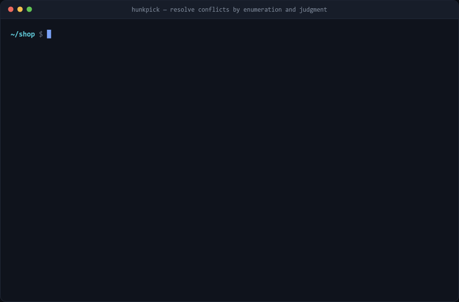

# Hunkpick

Resolves git merge conflicts by generating the possible resolutions and having a model
pick one.

For each conflict it computes the candidate resolutions (ours, theirs, union, line merge,
token merge), discards the ones that do not parse, and sends the rest to a model to
choose between. The model selects a candidate. It does not write code, so it cannot
produce a file that fails to parse. It can pick the wrong candidate, which you catch by
reading the diff.



The clip runs it against four conflicts. It resolves three and leaves the fourth.
`demo/capture.sh` builds the repo and runs the commands, `demo/render.mjs` draws the
captured output.

**Contents:** [Quick start](#quick-start) · [Output](#output) · [How it works](#how-it-works) ·
[JSON](#json-files) · [Options](#options) · [Benchmark](#benchmark) ·
[Thresholds](#thresholds) · [Limits](#limits) · [Layout](#layout)

## Quick start

Requires Node 20+, git, and a [TypeSafe](https://typesafe.ai) API key. No runtime
dependencies; the tool imports only Node built-ins.

```bash
git clone https://github.com/hfnissum-byte/hunkpick.git
cd hunkpick
cp .env.example .env        # add your key
node test/run.mjs           # 46 offline tests, no API calls
```

In a repository with conflicts:

```bash
node /path/to/hunkpick/hunkpick.mjs            # report only
node /path/to/hunkpick/hunkpick.mjs --apply    # write the resolutions that pass the gates
```

Without `--apply` nothing is modified. Nothing is staged or committed in either case.
Unresolved conflicts keep their markers.

## Output


| field | meaning |
| --- | --- |
| `RESOLVE` / `LEAVE` | whether the conflict will be written or left for you |
| `merged_tokens`, `union`, … | which kind of resolution was chosen |
| `approach` | probability the model assigns to that kind, 0 to 1 |
| `mechanical` | probability that this is a merge rather than a decision for a person |
| `correct` | JSON only: whether the key merge is right and safe to apply unreviewed |
| `no match` | the model's answer was that none of the candidates is the resolution |
| `│ …` | the lines that would be written |
| `runner-up` | next best candidate, shown when above 0.05 |

Both bars must clear their thresholds before a conflict is written. Bars are amber near
the threshold and red below it.

Resolution kinds:

| kind | result |
| --- | --- |
| `ours` | current branch's version |
| `theirs` | incoming branch's version |
| `union` | both, one after the other |
| `merged_lines` | both, combined across lines |
| `merged_tokens` | both, combined within a line |
| `structural` | JSON merged key by key |
| `base` / `drop` | revert both, or delete the region |

`server.js` line 9 is the one it left. Both branches set the same timeout, to 1s and 30s.
There is no mechanical answer, `mechanical 0.14` says so, and `theirs` is not a kind that
applies unattended.

`cart.js` line 3 is the borderline one. Both branches edited the same line compatibly, so
a token merge exists, but combining a tax rate with a quantity changes what the function
returns. It sits near the thresholds and does not always come out the same way: this run
resolved it at `approach 0.59`, an earlier one answered `no match` and left it. That is
the honest behaviour of a conflict on the boundary, not a bug.

## How it works

### 1. Rebuild the conflict with its base

The working-tree file contains both sides but not the common ancestor. hunkpick reads
git's index stages (`:1:` base, `:2:` ours, `:3:` theirs) and runs
`git merge-file --diff3` on them, which gives each hunk its base. The working tree is not
modified.

### 2. Generate candidates

Per hunk: `ours`, `theirs`, `base`, `union` in both orders, `drop`, plus a line-level and
a token-level three-way merge. The same merge function runs at both scales.

The token pass handles the case where both sides edited one line compatibly:

```
base      sum += it.price;
ours      sum += it.price * it.qty;
theirs    sum += it.price * (1 + TAX);
candidate sum += it.price * it.qty * (1 + TAX);
```

The candidate appears in neither branch.

### 3. Discard candidates that do not parse

Each candidate is rendered into the full file and parsed, with the other conflicts in
that file pinned to `ours`. Checking a hunk in isolation is not sufficient; it can parse
on its own and still break the surrounding code.

### 4. Ask the model

All conflicts in the repository go out in one request. Jev is a System One model: it
returns typed values with probabilities instead of generating text. Two question types
are used.

- `Choice` over the surviving candidates, plus a no-match option.
- `Noul`, a yes/no with a probability: whether a person needs to decide this.

The state also carries what each branch changed relative to the ancestor, counted in
lines. Without it a deletion looks like losing code, and the model keeps the code; that
was the single largest source of wrong picks.

The no-match option matters for the same reason. A `Choice` has to name one of its
options, so without somewhere to put "none of these", the model names the nearest
candidate and it gets written. Most of the remaining errors are regions the authors
resolved by hand, where no candidate could have been right.

The second question is separate because confidence does not cover it. A conflict can have
one clearly best mechanical resolution and still require a decision, for example two
valid timeout values or a check that one branch removed.

### 5. Gate

Thresholds are applied in code. The chosen kind must also be on the list allowed to apply
unattended. Conflicts that fail a gate, or that came back as no-match, keep their markers.

## JSON files

A line or token merge cannot resolve two branches adding different keys to
`package.json`, because the result requires a comma that appears in neither version.

`.json` files are therefore parsed from all three stages, merged key by key, and
serialised once. One Noul asks whether the result is correct and safe to apply.

The structural merge declines and falls back to the line path when it cannot settle the
conflict: two values for one key, an ambiguous array order, or a key deleted on one side
and edited on the other. It also declines when the result equals one side, since that is
a choice between branches and the Choice question handles it.

## Options

| Flag | |
| --- | --- |
| `--apply` | write files; without it nothing is modified |
| `--confidence <0-1>` | minimum `approach` (default 0.55) |
| `--safe <0-1>` | minimum `mechanical` (default 0.25) |
| `--kinds <a,b,…\|all>` | kinds allowed to apply unattended (default set from the benchmark) |
| `--context <n>` | lines of context sent to the model (default 6) |
| `--all` | apply everything, ignoring the gates |
| `--json` | machine-readable output |
| `--model <name>` | override the model |

Exit codes: `0` all resolved, `1` some left, `2` nothing to do or an error.

## Benchmark

`bench/replay.mjs` replays merges from a real repository. For each merge commit it checks
out the first parent, merges the second, runs hunkpick, and compares the result to the
merge commit's tree.

```bash
node bench/replay.mjs --repo /path/to/a/clone --max 25
```

Scoring is per conflict region, anchored on the stable lines on either side. Whole-file
comparison does not work here because merge commits also contain edits unrelated to the
conflicts.

### Results

The thresholds, the prompt and the kind list were set using merges 1–25. The numbers
below are from merges 26–75, which none of that was fitted to.

Across those 50 merges there were 266 conflict regions with a recoverable answer. In 74%
of them the committed resolution was among the candidates; the other 26% were not
reachable by any combination of the two sides.

| | |
| --- | --- |
| resolutions written | 163 |
| correct | 120 |
| **precision** | **74%** (95% CI 66–80%) |
| **recall of solvable conflicts** | **61%** |

31 of the 43 errors were regions where no candidate matched what was committed, because
the authors wrote the merge by hand. Counting only regions where a correct answer existed,
precision is 91%. That does not make the other 12 harmless: a wrong resolution is a wrong
resolution whether or not a right one was available.

By kind, at the default thresholds and with no kind filter:

| kind chosen | correct |
| --- | --- |
| `merged_lines` | 21/23 (91%) |
| `ours` | 98/134 (73%) |
| `theirs` | 4/20 (20%) |
| `union` | 1/5 (20%) |
| `union_reversed` | 0/1 |
| `merged_tokens` | 0/1 |

Excluding `theirs`, `union_reversed`, `base` and `drop` from unattended use takes overall
precision from 67% to 74%. That is the default; `--kinds all` restores them. `union` is
only weakly supported at n=5 and `merged_tokens` is effectively unmeasured, since express
never produced a conflict where a token merge was the answer.

The committed resolutions were `ours` most of the time. Express merges a maintenance
branch into a development branch and the development side usually wins, so these
proportions are specific to that workflow.

### What moved the numbers

Three changes, each measured against the setting before it:

**Telling the model what each side did.** The dominant selection error was picking the
incoming version when the current branch had deleted a region and the incoming branch had
edited one line inside it — 24 of 38 wrong picks. Shown only the two versions, a deletion
looks like losing code. `lib/judge.mjs` now states, in lines, what each branch changed
relative to the ancestor. Correct selections went from 51 to 58 out of 118.

**Fixing the thresholds.** On identical held-out data, changing only the gates:

| gates | applied | correct | precision | recall |
| --- | --- | --- | --- | --- |
| 0.75 / 0.45 | 60 | 42 | 70% | 21% |
| 0.55 / 0.25 | 163 | 120 | 74% | 61% |

Better on both axes. The `mechanical` threshold had been discarding correct answers for
nothing — see below.

**Letting the model decline.** The `Choice` had to name a candidate even when the right
answer was not among them, and that answer got written. Adding a no-match option, on the
same merges: precision 73% → 81%, wrong resolutions 24 → 15, at the cost of one correct
resolution.

## Thresholds

Binned by the reported number, over the held-out runs:

| `approach` | correct | | `mechanical` | correct |
| --- | --- | --- | --- | --- |
| 0.45–0.60 | 67% | | 0.15–0.25 | 71% |
| 0.60–0.75 | 71% | | 0.25–0.35 | 100% |
| 0.75–0.90 | 80% | | 0.35–0.45 | 50% |
| 0.90–1.00 | 84% | | 0.45+ | 73–77% |

`approach` is monotonic: it predicts correctness and is worth gating on. `mechanical` is
flat, so as an accuracy gate it does nothing but cut coverage, which is why it went from
0.45 to 0.25.

That is not a fault in the Noul. It answers "does a person need to decide this", which is
not the same question as "is this pick correct" — a conflict can be resolvable the way the
maintainer resolved it and still be a decision you want to make yourself. It is kept as a
gate for the extreme cases, and as a column you can read, but it is not evidence about
accuracy and is not tuned as though it were.

Both numbers are fitted to one repository. Run the benchmark on your own merges with
`--json`, compare against what you would have done, and move them. `--confidence 0.75`
trades coverage for precision: 76% at 40% recall on the same data.

### Gating on approach rather than confidence

Two orderings of a union are the same resolution in a different order. The Choice
distributes probability across both, which lowers confidence even though the model is not
uncertain about the kind.

The first conflict this was tested on selected the correct resolution at 0.64 with its own
reverse ordering at 0.30. Summed, the kind had 0.94.

The gate therefore sums probability across candidates of the same kind, which is what the
`approach` column shows. The selection within the kind is still the model's. `ours` and
`theirs` have one candidate each, so their numbers are unchanged.

## Limits

- Content conflicts only. Add/add, delete/modify and rename conflicts are reported and
  skipped.
- Syntax checking covers `.js`, `.mjs`, `.cjs`, `.py` and `.json`. Other file types are
  checked for leftover conflict markers and otherwise accepted. Add cases to
  `lib/validate.mjs` for more.
- `node --check` is unreliable for `.js`. A `.js` file containing ESM syntax exits 0 even
  when it does not parse: the CommonJS parse fails, Node retries as a module, and the
  error is discarded. The validator checks JavaScript as `.mjs`, then `.cjs`. There is a
  regression test for this.
- A resolution that parses and preserves both sides can still be wrong. Review the diff.

At 74% precision, roughly one in four of the resolutions it writes is not what you would
have written. It is a first pass over the mechanical conflicts, not an unattended merge
bot. The usual loop:

```bash
node hunkpick.mjs            # see what it proposes
node hunkpick.mjs --apply
git diff                     # read it before git add
```

If one is wrong, that file goes back to its original conflict. hunkpick never touches the
index, so all three stages are still there:

```bash
git checkout --merge -- path/to/file.js
```

## Layout

| Path | |
| --- | --- |
| `hunkpick.mjs` | CLI: generate, judge, gate, write, report |
| `lib/git.mjs` | index stages, diff3 reconstruction, branch context |
| `lib/conflicts.mjs` | conflict marker parsing and rendering |
| `lib/candidates.mjs` | three-way merge over lines and tokens |
| `lib/structured.mjs` | three-way merge over JSON keys |
| `lib/validate.mjs` | per-extension syntax checks |
| `lib/judge.mjs` | builds and sends the request |
| `test/run.mjs` | 46 offline tests, no git or API |
| `bench/replay.mjs` | replays merges and scores against the commit |
| `bench/inspect.mjs` | dumps one conflict with its candidates and the committed answer |
| `demo/capture.sh` | builds the demo repo and records the runs |
| `demo/render.mjs` | renders a recording as a GIF |
| `demo/svg.mjs` | renders one run as the SVG above |

```bash
npm test
```

## Credentials

`TYPESAFE_API_KEY` in a `.env` file next to `hunkpick.mjs`, or in the environment. `.env`
is gitignored; see `.env.example`.
